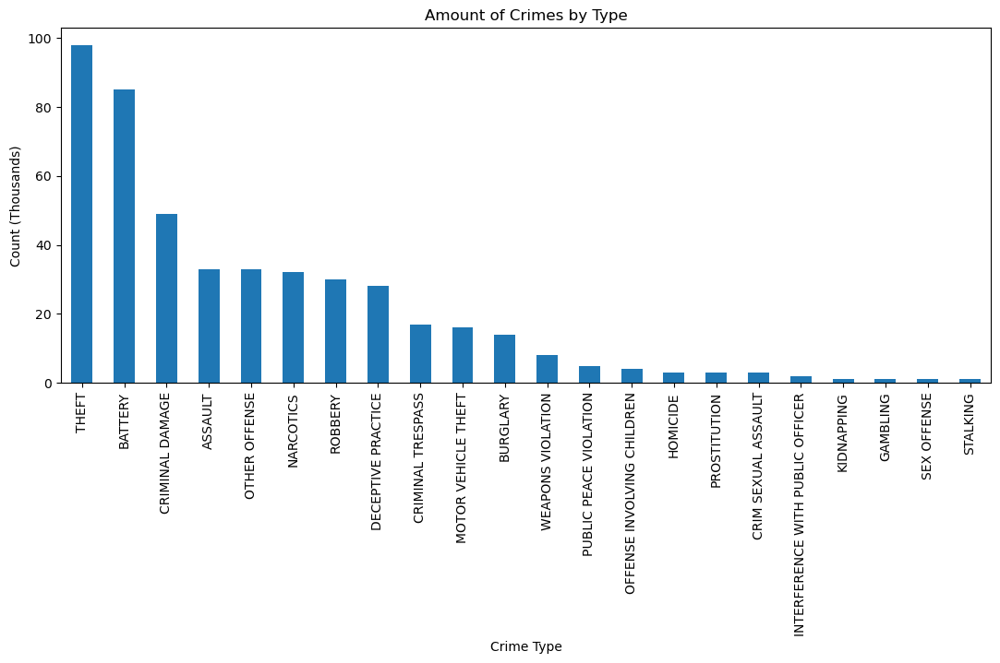
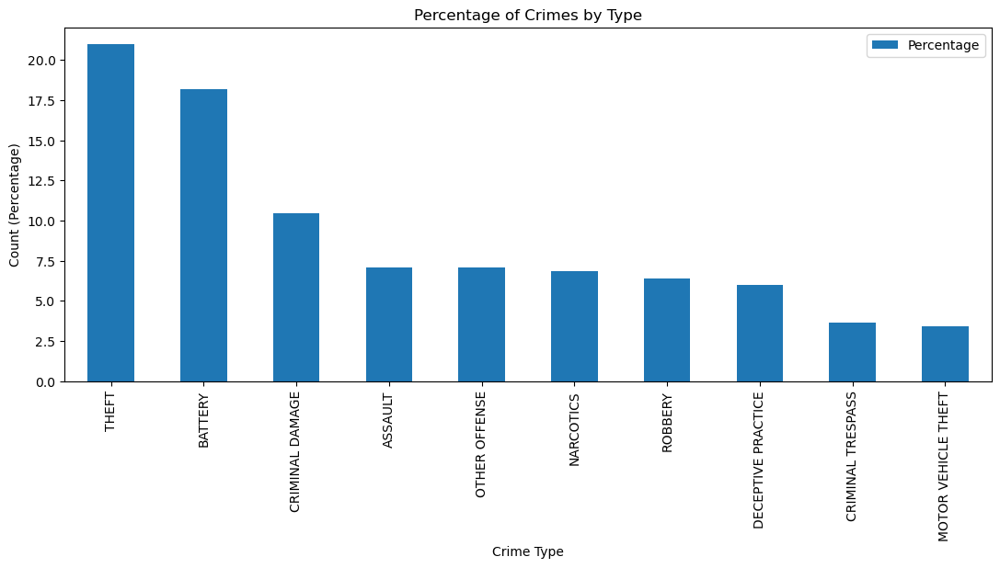
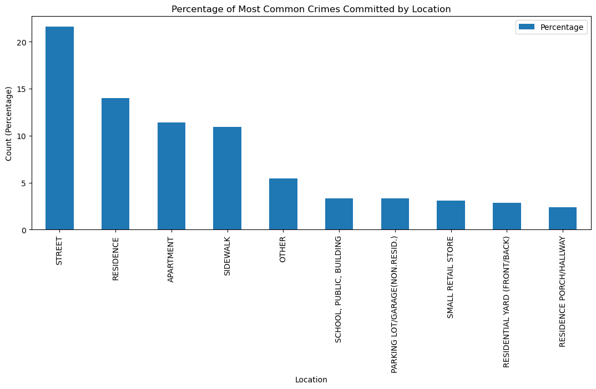

## Exploratory Data Analysis of Crime in Chicago
### <span style="color:#95B">*Understanding the relationship between time of day, location, and type of crime commited between the years of 2012 - 2017 in Chicago, IL.*</span>

Often referred to in pop-culture as "Chiraq", a play on words referring to levels of violence experienced in the Second Persian Gulf War in Iraq; Chicago has some of the highest crime rates across the United States. Being that crimes can vary among a wide array of categories, it is likely that the occurence frequencies of certain crimes may be affected by parameters such as location or time of day. It is imperative to gain a better understanding of high risk locations and times of day so that civillians, law enforcement and goverments are able to make better decisions aimed at improving overall inhabitant safety.

In this exploratory analysis I will analyze a crime dataset obtained from Kaggle.com in an attempt to gain a better understanding about the relationship between types of crime and how their occurances vary with time and place. The conclusions drawn from this analysis will lead to better decision making regarding day-to-day life for the inhabitants of Chicago.

## Methods
### Data Colleciton

This dataset was aquired from [Kaggle](https://www.kaggle.com/code/fahd09/eda-of-crime-in-chicago-2005-2016), a subsidiary of Google LLC that serves as an online data scientist and machine learning practitioner community as well as a repository of published data sets [1]. I will only be analyzing the csv file for data from 2012 - 2017. 


```python
# Importing necessary libraries and loading data
import datetime as dt
import pandas as pd
import numpy as np
import matplotlib as plt

data_filename = "./Chicago_Crimes_2012_to_2017.csv"
crime_data = pd.read_csv(data_filename)
```

### Data Cleaning

This dataset contains numerous colums that are irrelevant for the purposes of this exploratory analysis. I will remove unecessary columns and rename relevant columns so that they are more understandable. Additionally, rows containing missing data and duplicate crime entries are also removed. I will also be converting the 'Date' column from containing strings to values of the datetime object type so that they are easier to work with. 


```python
# Dropping all rows with missing data
crime_data = crime_data.dropna(axis=0)

# Removing all duplicate row entries
crime_data.drop_duplicates(subset=['ID',"Case Number"], keep="first", inplace=True)

# Removing uneeded columns
crime_data = crime_data.drop(['Unnamed: 0', 'ID', 'Case Number', 'Block', 'IUCR', 'Description', 
                     'Ward', 'Community Area', 'FBI Code' , 'X Coordinate', 'Y Coordinate',
                     'Year', 'Updated On', 'Latitude', 'Longitude', 'Location','Beat',
                     'District', 'Arrest', 'Domestic'], axis=1)

# Editing Date column to convert datetime strings to pandas datetime objects
crime_data['Date'] = pd.to_datetime(crime_data.Date, format='%m/%d/%Y %I:%M:%S %p')

# Renaming cloumns
crime_data.rename(columns = {'Primary Type':'Crime Type', 'Location Description':'Location'}, inplace = True)
```


```python
crime_data
```


<div>
<style scoped>
    .dataframe tbody tr th:only-of-type {
        vertical-align: middle;
    }

    .dataframe tbody tr th {
        vertical-align: top;
    }

    .dataframe thead th {
        text-align: right;
    }
</style>
<table border="1" class="dataframe">
  <thead>
    <tr style="text-align: right;">
      <th></th>
      <th>Date</th>
      <th>Crime Type</th>
      <th>Location</th>
    </tr>
  </thead>
  <tbody>
    <tr>
      <th>0</th>
      <td>2016-05-03 23:40:00</td>
      <td>BATTERY</td>
      <td>APARTMENT</td>
    </tr>
    <tr>
      <th>1</th>
      <td>2016-05-03 21:40:00</td>
      <td>BATTERY</td>
      <td>RESIDENCE</td>
    </tr>
    <tr>
      <th>2</th>
      <td>2016-05-03 23:31:00</td>
      <td>PUBLIC PEACE VIOLATION</td>
      <td>STREET</td>
    </tr>
    <tr>
      <th>3</th>
      <td>2016-05-03 22:10:00</td>
      <td>BATTERY</td>
      <td>SIDEWALK</td>
    </tr>
    <tr>
      <th>4</th>
      <td>2016-05-03 22:00:00</td>
      <td>THEFT</td>
      <td>RESIDENCE</td>
    </tr>
    <tr>
      <th>...</th>
      <td>...</td>
      <td>...</td>
      <td>...</td>
    </tr>
    <tr>
      <th>494</th>
      <td>2016-05-04 19:20:00</td>
      <td>OTHER OFFENSE</td>
      <td>SMALL RETAIL STORE</td>
    </tr>
    <tr>
      <th>495</th>
      <td>2016-05-04 18:12:00</td>
      <td>BATTERY</td>
      <td>SIDEWALK</td>
    </tr>
    <tr>
      <th>496</th>
      <td>2016-05-04 18:11:00</td>
      <td>CRIMINAL DAMAGE</td>
      <td>RESIDENCE</td>
    </tr>
    <tr>
      <th>497</th>
      <td>2016-05-04 18:11:00</td>
      <td>CRIMINAL DAMAGE</td>
      <td>RESIDENCE</td>
    </tr>
    <tr>
      <th>498</th>
      <td>2016-05-04 17:23:00</td>
      <td>BATTERY</td>
      <td>RESIDENCE</td>
    </tr>
  </tbody>
</table>
<p>467 rows × 3 columns</p>
</div>


## Exploratory Analysis and Visualization
### Distribution of Crimes by Type

Let us first explore the distribution of the occurence frequency of each type of crime between the years of 2012 and 2017. 


```python
# Finding the count of all crime types between the years of 2012 and 2017
crime_counts = pd.Series(crime_data.groupby(['Crime Type']).size())
crime_counts = crime_counts.sort_values(ascending=False, kind='quicksort')

# Creating a histogram of the distribution
crime_counts.plot(kind='bar', figsize=(13,5), ylabel="Count (Thousands)", title="Amount of Crimes by Type")
```


    <AxesSubplot:title={'center':'Amount of Crimes by Type'}, xlabel='Crime Type', ylabel='Count (Thousands)'>


    

    


We can see from the above distribution that the majority of crimes types are theft and battery.

Next, let us determine the crime type totals in terms of percentage. We can view the percentages in table formate to get a better understanding of the figures.


```python
# Percentage of crimes committed by type
crimePercentages = pd.Series(100*(crime_data.groupby('Crime Type').size()/crime_data.groupby('Crime Type').size().sum()))
crimePercentages = crimePercentages.sort_values(ascending=False)
crimePercentages = pd.DataFrame(crimePercentages, columns=['Percentage']).reset_index()
crimePercentages
```


<div>
<style scoped>
    .dataframe tbody tr th:only-of-type {
        vertical-align: middle;
    }

    .dataframe tbody tr th {
        vertical-align: top;
    }

    .dataframe thead th {
        text-align: right;
    }
</style>
<table border="1" class="dataframe">
  <thead>
    <tr style="text-align: right;">
      <th></th>
      <th>Crime Type</th>
      <th>Percentage</th>
    </tr>
  </thead>
  <tbody>
    <tr>
      <th>0</th>
      <td>THEFT</td>
      <td>20.985011</td>
    </tr>
    <tr>
      <th>1</th>
      <td>BATTERY</td>
      <td>18.201285</td>
    </tr>
    <tr>
      <th>2</th>
      <td>CRIMINAL DAMAGE</td>
      <td>10.492505</td>
    </tr>
    <tr>
      <th>3</th>
      <td>ASSAULT</td>
      <td>7.066381</td>
    </tr>
    <tr>
      <th>4</th>
      <td>OTHER OFFENSE</td>
      <td>7.066381</td>
    </tr>
    <tr>
      <th>5</th>
      <td>NARCOTICS</td>
      <td>6.852248</td>
    </tr>
    <tr>
      <th>6</th>
      <td>ROBBERY</td>
      <td>6.423983</td>
    </tr>
    <tr>
      <th>7</th>
      <td>DECEPTIVE PRACTICE</td>
      <td>5.995717</td>
    </tr>
    <tr>
      <th>8</th>
      <td>CRIMINAL TRESPASS</td>
      <td>3.640257</td>
    </tr>
    <tr>
      <th>9</th>
      <td>MOTOR VEHICLE THEFT</td>
      <td>3.426124</td>
    </tr>
    <tr>
      <th>10</th>
      <td>BURGLARY</td>
      <td>2.997859</td>
    </tr>
    <tr>
      <th>11</th>
      <td>WEAPONS VIOLATION</td>
      <td>1.713062</td>
    </tr>
    <tr>
      <th>12</th>
      <td>PUBLIC PEACE VIOLATION</td>
      <td>1.070664</td>
    </tr>
    <tr>
      <th>13</th>
      <td>OFFENSE INVOLVING CHILDREN</td>
      <td>0.856531</td>
    </tr>
    <tr>
      <th>14</th>
      <td>HOMICIDE</td>
      <td>0.642398</td>
    </tr>
    <tr>
      <th>15</th>
      <td>PROSTITUTION</td>
      <td>0.642398</td>
    </tr>
    <tr>
      <th>16</th>
      <td>CRIM SEXUAL ASSAULT</td>
      <td>0.642398</td>
    </tr>
    <tr>
      <th>17</th>
      <td>INTERFERENCE WITH PUBLIC OFFICER</td>
      <td>0.428266</td>
    </tr>
    <tr>
      <th>18</th>
      <td>KIDNAPPING</td>
      <td>0.214133</td>
    </tr>
    <tr>
      <th>19</th>
      <td>GAMBLING</td>
      <td>0.214133</td>
    </tr>
    <tr>
      <th>20</th>
      <td>SEX OFFENSE</td>
      <td>0.214133</td>
    </tr>
    <tr>
      <th>21</th>
      <td>STALKING</td>
      <td>0.214133</td>
    </tr>
  </tbody>
</table>
</div>


Let us consider only the top 10 types of crime by percentage.


```python
crimePercentages = crimePercentages.iloc[0:10]
print('-------------------------------\nThese crime types account for the top ',
      round(crimePercentages['Percentage'].sum(), 2), '% of all crimes commited.\n-------------------------------', sep="" )

crimePercentages
```

    -------------------------------
    These crime types account for the top 90.15% of all crimes commited.
    -------------------------------


<div>
<style scoped>
    .dataframe tbody tr th:only-of-type {
        vertical-align: middle;
    }

    .dataframe tbody tr th {
        vertical-align: top;
    }

    .dataframe thead th {
        text-align: right;
    }
</style>
<table border="1" class="dataframe">
  <thead>
    <tr style="text-align: right;">
      <th></th>
      <th>Crime Type</th>
      <th>Percentage</th>
    </tr>
  </thead>
  <tbody>
    <tr>
      <th>0</th>
      <td>THEFT</td>
      <td>20.985011</td>
    </tr>
    <tr>
      <th>1</th>
      <td>BATTERY</td>
      <td>18.201285</td>
    </tr>
    <tr>
      <th>2</th>
      <td>CRIMINAL DAMAGE</td>
      <td>10.492505</td>
    </tr>
    <tr>
      <th>3</th>
      <td>ASSAULT</td>
      <td>7.066381</td>
    </tr>
    <tr>
      <th>4</th>
      <td>OTHER OFFENSE</td>
      <td>7.066381</td>
    </tr>
    <tr>
      <th>5</th>
      <td>NARCOTICS</td>
      <td>6.852248</td>
    </tr>
    <tr>
      <th>6</th>
      <td>ROBBERY</td>
      <td>6.423983</td>
    </tr>
    <tr>
      <th>7</th>
      <td>DECEPTIVE PRACTICE</td>
      <td>5.995717</td>
    </tr>
    <tr>
      <th>8</th>
      <td>CRIMINAL TRESPASS</td>
      <td>3.640257</td>
    </tr>
    <tr>
      <th>9</th>
      <td>MOTOR VEHICLE THEFT</td>
      <td>3.426124</td>
    </tr>
  </tbody>
</table>
</div>


We can see again that theft and battery again make up the mojarity of committed crimes at ~22.7% and ~18.26% respectively.

Here is a graphical comparison view of the types of crimes that make up the top 92.01% of all crimes committed:


```python
crimePercentages.plot(kind="bar", x='Crime Type', figsize=(13,5), ylabel="Count (Percentage)", title="Percentage of Crimes by Type")

```


    <AxesSubplot:title={'center':'Percentage of Crimes by Type'}, xlabel='Crime Type', ylabel='Count (Percentage)'>


    

    


We can now further analyze the top ~92% of crime types by determining the percentage breakdown for the locations where these crimes occur.


```python
#we are retrieving only those columns that correspond to the top 10 ~92% of crimes
crime_locations = crime_data.loc[crime_data['Crime Type'].isin(crimePercentages['Crime Type']), :]
crime_locations.drop('Date', axis=1)

sum = crime_locations.groupby('Location').size().sum()

locationPercentages = pd.Series(round(100*(crime_locations.groupby('Location').size()/sum), 2)).sort_values(ascending=False)
locationPercentages = pd.DataFrame(locationPercentages, columns=['Percentage']).reset_index()
print("Here we can see the percentage of occurence of the top ~92% of crime types at each given location:")
locationPercentages

```

    Here we can see the percentage of occurence of the top ~92% of crime types at each given location:


<div>
<style scoped>
    .dataframe tbody tr th:only-of-type {
        vertical-align: middle;
    }

    .dataframe tbody tr th {
        vertical-align: top;
    }

    .dataframe thead th {
        text-align: right;
    }
</style>
<table border="1" class="dataframe">
  <thead>
    <tr style="text-align: right;">
      <th></th>
      <th>Location</th>
      <th>Percentage</th>
    </tr>
  </thead>
  <tbody>
    <tr>
      <th>0</th>
      <td>STREET</td>
      <td>21.62</td>
    </tr>
    <tr>
      <th>1</th>
      <td>RESIDENCE</td>
      <td>14.01</td>
    </tr>
    <tr>
      <th>2</th>
      <td>APARTMENT</td>
      <td>11.40</td>
    </tr>
    <tr>
      <th>3</th>
      <td>SIDEWALK</td>
      <td>10.93</td>
    </tr>
    <tr>
      <th>4</th>
      <td>OTHER</td>
      <td>5.46</td>
    </tr>
    <tr>
      <th>5</th>
      <td>SCHOOL, PUBLIC, BUILDING</td>
      <td>3.33</td>
    </tr>
    <tr>
      <th>6</th>
      <td>PARKING LOT/GARAGE(NON.RESID.)</td>
      <td>3.33</td>
    </tr>
    <tr>
      <th>7</th>
      <td>SMALL RETAIL STORE</td>
      <td>3.09</td>
    </tr>
    <tr>
      <th>8</th>
      <td>RESIDENTIAL YARD (FRONT/BACK)</td>
      <td>2.85</td>
    </tr>
    <tr>
      <th>9</th>
      <td>RESIDENCE PORCH/HALLWAY</td>
      <td>2.38</td>
    </tr>
    <tr>
      <th>10</th>
      <td>BANK</td>
      <td>1.66</td>
    </tr>
    <tr>
      <th>11</th>
      <td>ALLEY</td>
      <td>1.66</td>
    </tr>
    <tr>
      <th>12</th>
      <td>RESIDENCE-GARAGE</td>
      <td>1.66</td>
    </tr>
    <tr>
      <th>13</th>
      <td>RESTAURANT</td>
      <td>1.66</td>
    </tr>
    <tr>
      <th>14</th>
      <td>DRUG STORE</td>
      <td>1.19</td>
    </tr>
    <tr>
      <th>15</th>
      <td>SCHOOL, PUBLIC, GROUNDS</td>
      <td>1.19</td>
    </tr>
    <tr>
      <th>16</th>
      <td>CONVENIENCE STORE</td>
      <td>0.95</td>
    </tr>
    <tr>
      <th>17</th>
      <td>VEHICLE NON-COMMERCIAL</td>
      <td>0.95</td>
    </tr>
    <tr>
      <th>18</th>
      <td>GROCERY FOOD STORE</td>
      <td>0.95</td>
    </tr>
    <tr>
      <th>19</th>
      <td>HOTEL/MOTEL</td>
      <td>0.71</td>
    </tr>
    <tr>
      <th>20</th>
      <td>DEPARTMENT STORE</td>
      <td>0.71</td>
    </tr>
    <tr>
      <th>21</th>
      <td>COMMERCIAL / BUSINESS OFFICE</td>
      <td>0.71</td>
    </tr>
    <tr>
      <th>22</th>
      <td>BAR OR TAVERN</td>
      <td>0.71</td>
    </tr>
    <tr>
      <th>23</th>
      <td>ATHLETIC CLUB</td>
      <td>0.71</td>
    </tr>
    <tr>
      <th>24</th>
      <td>GAS STATION</td>
      <td>0.48</td>
    </tr>
    <tr>
      <th>25</th>
      <td>CTA TRAIN</td>
      <td>0.48</td>
    </tr>
    <tr>
      <th>26</th>
      <td>SCHOOL, PRIVATE, GROUNDS</td>
      <td>0.48</td>
    </tr>
    <tr>
      <th>27</th>
      <td>POLICE FACILITY/VEH PARKING LOT</td>
      <td>0.48</td>
    </tr>
    <tr>
      <th>28</th>
      <td>SPORTS ARENA/STADIUM</td>
      <td>0.24</td>
    </tr>
    <tr>
      <th>29</th>
      <td>TAVERN/LIQUOR STORE</td>
      <td>0.24</td>
    </tr>
    <tr>
      <th>30</th>
      <td>TAXICAB</td>
      <td>0.24</td>
    </tr>
    <tr>
      <th>31</th>
      <td>VACANT LOT/LAND</td>
      <td>0.24</td>
    </tr>
    <tr>
      <th>32</th>
      <td>ABANDONED BUILDING</td>
      <td>0.24</td>
    </tr>
    <tr>
      <th>33</th>
      <td>LIBRARY</td>
      <td>0.24</td>
    </tr>
    <tr>
      <th>34</th>
      <td>PARK PROPERTY</td>
      <td>0.24</td>
    </tr>
    <tr>
      <th>35</th>
      <td>MEDICAL/DENTAL OFFICE</td>
      <td>0.24</td>
    </tr>
    <tr>
      <th>36</th>
      <td>HOSPITAL BUILDING/GROUNDS</td>
      <td>0.24</td>
    </tr>
    <tr>
      <th>37</th>
      <td>HIGHWAY/EXPRESSWAY</td>
      <td>0.24</td>
    </tr>
    <tr>
      <th>38</th>
      <td>CTA STATION</td>
      <td>0.24</td>
    </tr>
    <tr>
      <th>39</th>
      <td>CTA PLATFORM</td>
      <td>0.24</td>
    </tr>
    <tr>
      <th>40</th>
      <td>CTA BUS</td>
      <td>0.24</td>
    </tr>
    <tr>
      <th>41</th>
      <td>COLLEGE/UNIVERSITY GROUNDS</td>
      <td>0.24</td>
    </tr>
    <tr>
      <th>42</th>
      <td>CHA PARKING LOT/GROUNDS</td>
      <td>0.24</td>
    </tr>
    <tr>
      <th>43</th>
      <td>CHA HALLWAY/STAIRWELL/ELEVATOR</td>
      <td>0.24</td>
    </tr>
    <tr>
      <th>44</th>
      <td>ATM (AUTOMATIC TELLER MACHINE)</td>
      <td>0.24</td>
    </tr>
    <tr>
      <th>45</th>
      <td>VEHICLE-COMMERCIAL</td>
      <td>0.24</td>
    </tr>
  </tbody>
</table>
</div>


It appears that the majority of these crimes tend to occur on the street, in residences, in apartments and on the sidewalk.

We will now consider the top 10 most at risk locations:


```python
locationPercentages = locationPercentages.iloc[0:10]
total = round(locationPercentages['Percentage'].sum(), 2)
print(f"The following locations in the city account for {total}% out of the top ~92% of crime types committed in Chicago:")
locationPercentages
```

    The following locations in the city account for 78.4% out of the top ~92% of crime types committed in Chicago:


<div>
<style scoped>
    .dataframe tbody tr th:only-of-type {
        vertical-align: middle;
    }

    .dataframe tbody tr th {
        vertical-align: top;
    }

    .dataframe thead th {
        text-align: right;
    }
</style>
<table border="1" class="dataframe">
  <thead>
    <tr style="text-align: right;">
      <th></th>
      <th>Location</th>
      <th>Percentage</th>
    </tr>
  </thead>
  <tbody>
    <tr>
      <th>0</th>
      <td>STREET</td>
      <td>21.62</td>
    </tr>
    <tr>
      <th>1</th>
      <td>RESIDENCE</td>
      <td>14.01</td>
    </tr>
    <tr>
      <th>2</th>
      <td>APARTMENT</td>
      <td>11.40</td>
    </tr>
    <tr>
      <th>3</th>
      <td>SIDEWALK</td>
      <td>10.93</td>
    </tr>
    <tr>
      <th>4</th>
      <td>OTHER</td>
      <td>5.46</td>
    </tr>
    <tr>
      <th>5</th>
      <td>SCHOOL, PUBLIC, BUILDING</td>
      <td>3.33</td>
    </tr>
    <tr>
      <th>6</th>
      <td>PARKING LOT/GARAGE(NON.RESID.)</td>
      <td>3.33</td>
    </tr>
    <tr>
      <th>7</th>
      <td>SMALL RETAIL STORE</td>
      <td>3.09</td>
    </tr>
    <tr>
      <th>8</th>
      <td>RESIDENTIAL YARD (FRONT/BACK)</td>
      <td>2.85</td>
    </tr>
    <tr>
      <th>9</th>
      <td>RESIDENCE PORCH/HALLWAY</td>
      <td>2.38</td>
    </tr>
  </tbody>
</table>
</div>


A graphical representation of the most at-risk locations for the top ~92% of crime types:


```python
locationPercentages.plot(kind="bar", x = 'Location', figsize=(13,5), ylabel="Count (Percentage)", title="Percentage of Most Common Crimes Committed by Location")
```


    <AxesSubplot:title={'center':'Percentage of Most Common Crimes Committed by Location'}, xlabel='Location', ylabel='Count (Percentage)'>


    

    


We will now round the time of occurence of each of the the top ten crime types to the nearest hour and create a heatmap showcasing the most at-risk time of day for a given crime type.


```python
#rounding time of crime committed to the nearest hour 
def rounder(t):
    if t.minute >= 30:
        if t.hour == 23:
            return t.replace(second=0, microsecond=0, minute=0, hour=0)
        return t.replace(second=0, microsecond=0, minute=0, hour=t.hour+1)
    else:
        return t.replace(second=0, microsecond=0, minute=0)

crime_data['Date'] = [rounder(dt.datetime.time(i)).hour for i in crime_data.Date]
crime_data
```


<div>
<style scoped>
    .dataframe tbody tr th:only-of-type {
        vertical-align: middle;
    }

    .dataframe tbody tr th {
        vertical-align: top;
    }

    .dataframe thead th {
        text-align: right;
    }
</style>
<table border="1" class="dataframe">
  <thead>
    <tr style="text-align: right;">
      <th></th>
      <th>Date</th>
      <th>Crime Type</th>
      <th>Location</th>
    </tr>
  </thead>
  <tbody>
    <tr>
      <th>0</th>
      <td>0</td>
      <td>BATTERY</td>
      <td>APARTMENT</td>
    </tr>
    <tr>
      <th>1</th>
      <td>22</td>
      <td>BATTERY</td>
      <td>RESIDENCE</td>
    </tr>
    <tr>
      <th>2</th>
      <td>0</td>
      <td>PUBLIC PEACE VIOLATION</td>
      <td>STREET</td>
    </tr>
    <tr>
      <th>3</th>
      <td>22</td>
      <td>BATTERY</td>
      <td>SIDEWALK</td>
    </tr>
    <tr>
      <th>4</th>
      <td>22</td>
      <td>THEFT</td>
      <td>RESIDENCE</td>
    </tr>
    <tr>
      <th>...</th>
      <td>...</td>
      <td>...</td>
      <td>...</td>
    </tr>
    <tr>
      <th>494</th>
      <td>19</td>
      <td>OTHER OFFENSE</td>
      <td>SMALL RETAIL STORE</td>
    </tr>
    <tr>
      <th>495</th>
      <td>18</td>
      <td>BATTERY</td>
      <td>SIDEWALK</td>
    </tr>
    <tr>
      <th>496</th>
      <td>18</td>
      <td>CRIMINAL DAMAGE</td>
      <td>RESIDENCE</td>
    </tr>
    <tr>
      <th>497</th>
      <td>18</td>
      <td>CRIMINAL DAMAGE</td>
      <td>RESIDENCE</td>
    </tr>
    <tr>
      <th>498</th>
      <td>17</td>
      <td>BATTERY</td>
      <td>RESIDENCE</td>
    </tr>
  </tbody>
</table>
<p>467 rows × 3 columns</p>
</div>


Removing all but the top ten previously determined crime types:


```python
crimeTime = crime_data.loc[crime_data['Crime Type'].isin(crimePercentages['Crime Type'])]
crimeTime

```


<div>
<style scoped>
    .dataframe tbody tr th:only-of-type {
        vertical-align: middle;
    }

    .dataframe tbody tr th {
        vertical-align: top;
    }

    .dataframe thead th {
        text-align: right;
    }
</style>
<table border="1" class="dataframe">
  <thead>
    <tr style="text-align: right;">
      <th></th>
      <th>Date</th>
      <th>Crime Type</th>
      <th>Location</th>
    </tr>
  </thead>
  <tbody>
    <tr>
      <th>0</th>
      <td>0</td>
      <td>BATTERY</td>
      <td>APARTMENT</td>
    </tr>
    <tr>
      <th>1</th>
      <td>22</td>
      <td>BATTERY</td>
      <td>RESIDENCE</td>
    </tr>
    <tr>
      <th>3</th>
      <td>22</td>
      <td>BATTERY</td>
      <td>SIDEWALK</td>
    </tr>
    <tr>
      <th>4</th>
      <td>22</td>
      <td>THEFT</td>
      <td>RESIDENCE</td>
    </tr>
    <tr>
      <th>5</th>
      <td>23</td>
      <td>BATTERY</td>
      <td>STREET</td>
    </tr>
    <tr>
      <th>...</th>
      <td>...</td>
      <td>...</td>
      <td>...</td>
    </tr>
    <tr>
      <th>494</th>
      <td>19</td>
      <td>OTHER OFFENSE</td>
      <td>SMALL RETAIL STORE</td>
    </tr>
    <tr>
      <th>495</th>
      <td>18</td>
      <td>BATTERY</td>
      <td>SIDEWALK</td>
    </tr>
    <tr>
      <th>496</th>
      <td>18</td>
      <td>CRIMINAL DAMAGE</td>
      <td>RESIDENCE</td>
    </tr>
    <tr>
      <th>497</th>
      <td>18</td>
      <td>CRIMINAL DAMAGE</td>
      <td>RESIDENCE</td>
    </tr>
    <tr>
      <th>498</th>
      <td>17</td>
      <td>BATTERY</td>
      <td>RESIDENCE</td>
    </tr>
  </tbody>
</table>
<p>421 rows × 3 columns</p>
</div>


Using the top 10 crime types and their newly calculated approximate times of occurence, we are going to generate a heatmap that will provide a good visual display of the most at-risk times of day for each given crime type. 


```python
from matplotlib import colors

rows = { crime : [0 for _ in range(24)] for crime in crimeTime['Crime Type'] }

vals = crimeTime.groupby(['Crime Type', 'Date']).size()

for key, value in crimeTime.groupby(['Crime Type', 'Date']):

    rows[key[0]][key[1]] = vals[key[0], key[1]]
    

index   = crimeTime['Crime Type'].unique()

columns = [i for i in range(24)]

df = pd.DataFrame(rows, index=index, columns=columns)

for key, value in rows.items():
    
    for index, count in enumerate(value):
        
        df[index][key] = count


def background_gradient(s, m=None, M=None, cmap='Greys', low=0, high=0):

    if m is None:
        m = s.min().min()
    if M is None:
        M = s.max().max()
    rng = M - m
    norm = colors.Normalize(m - (rng * low),
                            M + (rng * high))
    normed = s.apply(norm)

    cm = plt.cm.get_cmap(cmap)
    c = normed.applymap(lambda x: colors.rgb2hex(cm(x)))
    
    def hex_to_rgb(hex):
        return (int(hex[0:2], 16), int(hex[2:4], 16), int(hex[4:6], 16))
    
    def rgb_to_hex(r, g, b):
        return ('#{:X}{:X}{:X}').format(r, g, b)
      
    def colorit(x):
        r, g, b = hex_to_rgb(x[1:])
        
        if (r*0.299 + g*0.587 + b*0.114) > 186: 
            fore = "#000000"
        else:
            fore = "#ffffff"
        
        return 'color : {}; background-color: {}'.format(fore, x)
    
    ret = c.applymap(colorit)
    return ret


df.style.apply(background_gradient, axis=None)
```


<style type="text/css">
#T_9f04a_row0_col0, #T_9f04a_row0_col13, #T_9f04a_row0_col15, #T_9f04a_row0_col23, #T_9f04a_row1_col7, #T_9f04a_row1_col9, #T_9f04a_row1_col12, #T_9f04a_row1_col13, #T_9f04a_row1_col15, #T_9f04a_row1_col16, #T_9f04a_row1_col21, #T_9f04a_row2_col9, #T_9f04a_row6_col9, #T_9f04a_row7_col1, #T_9f04a_row7_col18 {
  color: #ffffff;
  background-color: #fb7858;
}
#T_9f04a_row0_col1, #T_9f04a_row0_col3, #T_9f04a_row0_col6, #T_9f04a_row1_col8, #T_9f04a_row1_col10, #T_9f04a_row2_col4, #T_9f04a_row2_col12, #T_9f04a_row2_col17, #T_9f04a_row2_col18, #T_9f04a_row3_col19, #T_9f04a_row4_col2, #T_9f04a_row4_col16, #T_9f04a_row5_col13, #T_9f04a_row6_col11, #T_9f04a_row7_col17, #T_9f04a_row8_col16, #T_9f04a_row8_col18, #T_9f04a_row9_col13 {
  color: #000000;
  background-color: #fcb499;
}
#T_9f04a_row0_col2, #T_9f04a_row0_col4, #T_9f04a_row0_col5, #T_9f04a_row0_col7, #T_9f04a_row0_col14, #T_9f04a_row1_col2, #T_9f04a_row1_col5, #T_9f04a_row1_col6, #T_9f04a_row2_col3, #T_9f04a_row2_col10, #T_9f04a_row3_col0, #T_9f04a_row3_col7, #T_9f04a_row3_col21, #T_9f04a_row4_col1, #T_9f04a_row4_col9, #T_9f04a_row4_col10, #T_9f04a_row4_col12, #T_9f04a_row4_col14, #T_9f04a_row4_col18, #T_9f04a_row5_col0, #T_9f04a_row5_col8, #T_9f04a_row5_col10, #T_9f04a_row5_col11, #T_9f04a_row5_col14, #T_9f04a_row5_col16, #T_9f04a_row5_col18, #T_9f04a_row5_col21, #T_9f04a_row6_col12, #T_9f04a_row6_col13, #T_9f04a_row6_col14, #T_9f04a_row6_col18, #T_9f04a_row7_col0, #T_9f04a_row7_col2, #T_9f04a_row7_col6, #T_9f04a_row7_col8, #T_9f04a_row7_col9, #T_9f04a_row7_col12, #T_9f04a_row7_col13, #T_9f04a_row7_col14, #T_9f04a_row7_col16, #T_9f04a_row7_col22, #T_9f04a_row9_col0, #T_9f04a_row9_col16 {
  color: #000000;
  background-color: #fdd0bc;
}
#T_9f04a_row0_col8, #T_9f04a_row0_col9, #T_9f04a_row0_col10, #T_9f04a_row0_col11, #T_9f04a_row0_col12, #T_9f04a_row0_col18, #T_9f04a_row1_col1, #T_9f04a_row1_col20, #T_9f04a_row4_col0, #T_9f04a_row4_col15, #T_9f04a_row5_col12, #T_9f04a_row5_col19, #T_9f04a_row7_col15, #T_9f04a_row7_col23, #T_9f04a_row8_col12, #T_9f04a_row9_col10, #T_9f04a_row9_col11, #T_9f04a_row9_col18 {
  color: #ffffff;
  background-color: #fc9576;
}
#T_9f04a_row0_col16 {
  color: #ffffff;
  background-color: #b61319;
}
#T_9f04a_row0_col17, #T_9f04a_row0_col22, #T_9f04a_row1_col11, #T_9f04a_row1_col14, #T_9f04a_row1_col18, #T_9f04a_row1_col19, #T_9f04a_row1_col22, #T_9f04a_row6_col0 {
  color: #ffffff;
  background-color: #f7593f;
}
#T_9f04a_row0_col19, #T_9f04a_row0_col20, #T_9f04a_row1_col3, #T_9f04a_row1_col4, #T_9f04a_row2_col0, #T_9f04a_row2_col1, #T_9f04a_row2_col2, #T_9f04a_row2_col7, #T_9f04a_row2_col11, #T_9f04a_row2_col16, #T_9f04a_row2_col19, #T_9f04a_row2_col20, #T_9f04a_row3_col1, #T_9f04a_row3_col3, #T_9f04a_row3_col4, #T_9f04a_row3_col6, #T_9f04a_row3_col8, #T_9f04a_row3_col9, #T_9f04a_row3_col11, #T_9f04a_row3_col12, #T_9f04a_row3_col13, #T_9f04a_row3_col14, #T_9f04a_row3_col15, #T_9f04a_row3_col16, #T_9f04a_row3_col18, #T_9f04a_row4_col3, #T_9f04a_row4_col4, #T_9f04a_row4_col5, #T_9f04a_row4_col6, #T_9f04a_row4_col7, #T_9f04a_row4_col21, #T_9f04a_row4_col23, #T_9f04a_row5_col1, #T_9f04a_row5_col3, #T_9f04a_row5_col4, #T_9f04a_row5_col5, #T_9f04a_row5_col15, #T_9f04a_row5_col22, #T_9f04a_row5_col23, #T_9f04a_row6_col1, #T_9f04a_row6_col2, #T_9f04a_row6_col3, #T_9f04a_row6_col4, #T_9f04a_row6_col5, #T_9f04a_row6_col6, #T_9f04a_row6_col8, #T_9f04a_row6_col15, #T_9f04a_row6_col20, #T_9f04a_row6_col21, #T_9f04a_row6_col22, #T_9f04a_row7_col7, #T_9f04a_row8_col0, #T_9f04a_row8_col1, #T_9f04a_row8_col2, #T_9f04a_row8_col3, #T_9f04a_row8_col4, #T_9f04a_row8_col5, #T_9f04a_row8_col7, #T_9f04a_row8_col9, #T_9f04a_row8_col10, #T_9f04a_row8_col11, #T_9f04a_row8_col19, #T_9f04a_row8_col20, #T_9f04a_row8_col21, #T_9f04a_row8_col22, #T_9f04a_row9_col1, #T_9f04a_row9_col2, #T_9f04a_row9_col3, #T_9f04a_row9_col4, #T_9f04a_row9_col5, #T_9f04a_row9_col6, #T_9f04a_row9_col7, #T_9f04a_row9_col8, #T_9f04a_row9_col20, #T_9f04a_row9_col21, #T_9f04a_row9_col22, #T_9f04a_row9_col23 {
  color: #000000;
  background-color: #fff5f0;
}
#T_9f04a_row0_col21, #T_9f04a_row1_col0, #T_9f04a_row1_col23, #T_9f04a_row2_col5, #T_9f04a_row2_col6, #T_9f04a_row2_col8, #T_9f04a_row2_col13, #T_9f04a_row2_col14, #T_9f04a_row2_col15, #T_9f04a_row2_col21, #T_9f04a_row2_col22, #T_9f04a_row2_col23, #T_9f04a_row3_col2, #T_9f04a_row3_col5, #T_9f04a_row3_col10, #T_9f04a_row3_col17, #T_9f04a_row3_col20, #T_9f04a_row3_col22, #T_9f04a_row3_col23, #T_9f04a_row4_col8, #T_9f04a_row4_col11, #T_9f04a_row4_col13, #T_9f04a_row4_col17, #T_9f04a_row4_col19, #T_9f04a_row4_col20, #T_9f04a_row4_col22, #T_9f04a_row5_col2, #T_9f04a_row5_col6, #T_9f04a_row5_col7, #T_9f04a_row5_col9, #T_9f04a_row5_col17, #T_9f04a_row5_col20, #T_9f04a_row6_col7, #T_9f04a_row6_col10, #T_9f04a_row6_col16, #T_9f04a_row6_col17, #T_9f04a_row6_col19, #T_9f04a_row6_col23, #T_9f04a_row7_col3, #T_9f04a_row7_col4, #T_9f04a_row7_col5, #T_9f04a_row7_col10, #T_9f04a_row7_col11, #T_9f04a_row7_col19, #T_9f04a_row7_col20, #T_9f04a_row7_col21, #T_9f04a_row8_col6, #T_9f04a_row8_col8, #T_9f04a_row8_col13, #T_9f04a_row8_col14, #T_9f04a_row8_col15, #T_9f04a_row8_col17, #T_9f04a_row8_col23, #T_9f04a_row9_col9, #T_9f04a_row9_col12, #T_9f04a_row9_col15, #T_9f04a_row9_col17, #T_9f04a_row9_col19 {
  color: #000000;
  background-color: #fee6da;
}
#T_9f04a_row1_col17 {
  color: #ffffff;
  background-color: #67000d;
}
#T_9f04a_row9_col14 {
  color: #ffffff;
  background-color: #d11e1f;
}
</style>
<table id="T_9f04a">
  <thead>
    <tr>
      <th class="blank level0" >&nbsp;</th>
      <th id="T_9f04a_level0_col0" class="col_heading level0 col0" >0</th>
      <th id="T_9f04a_level0_col1" class="col_heading level0 col1" >1</th>
      <th id="T_9f04a_level0_col2" class="col_heading level0 col2" >2</th>
      <th id="T_9f04a_level0_col3" class="col_heading level0 col3" >3</th>
      <th id="T_9f04a_level0_col4" class="col_heading level0 col4" >4</th>
      <th id="T_9f04a_level0_col5" class="col_heading level0 col5" >5</th>
      <th id="T_9f04a_level0_col6" class="col_heading level0 col6" >6</th>
      <th id="T_9f04a_level0_col7" class="col_heading level0 col7" >7</th>
      <th id="T_9f04a_level0_col8" class="col_heading level0 col8" >8</th>
      <th id="T_9f04a_level0_col9" class="col_heading level0 col9" >9</th>
      <th id="T_9f04a_level0_col10" class="col_heading level0 col10" >10</th>
      <th id="T_9f04a_level0_col11" class="col_heading level0 col11" >11</th>
      <th id="T_9f04a_level0_col12" class="col_heading level0 col12" >12</th>
      <th id="T_9f04a_level0_col13" class="col_heading level0 col13" >13</th>
      <th id="T_9f04a_level0_col14" class="col_heading level0 col14" >14</th>
      <th id="T_9f04a_level0_col15" class="col_heading level0 col15" >15</th>
      <th id="T_9f04a_level0_col16" class="col_heading level0 col16" >16</th>
      <th id="T_9f04a_level0_col17" class="col_heading level0 col17" >17</th>
      <th id="T_9f04a_level0_col18" class="col_heading level0 col18" >18</th>
      <th id="T_9f04a_level0_col19" class="col_heading level0 col19" >19</th>
      <th id="T_9f04a_level0_col20" class="col_heading level0 col20" >20</th>
      <th id="T_9f04a_level0_col21" class="col_heading level0 col21" >21</th>
      <th id="T_9f04a_level0_col22" class="col_heading level0 col22" >22</th>
      <th id="T_9f04a_level0_col23" class="col_heading level0 col23" >23</th>
    </tr>
  </thead>
  <tbody>
    <tr>
      <th id="T_9f04a_level0_row0" class="row_heading level0 row0" >BATTERY</th>
      <td id="T_9f04a_row0_col0" class="data row0 col0" >5</td>
      <td id="T_9f04a_row0_col1" class="data row0 col1" >3</td>
      <td id="T_9f04a_row0_col2" class="data row0 col2" >2</td>
      <td id="T_9f04a_row0_col3" class="data row0 col3" >3</td>
      <td id="T_9f04a_row0_col4" class="data row0 col4" >2</td>
      <td id="T_9f04a_row0_col5" class="data row0 col5" >2</td>
      <td id="T_9f04a_row0_col6" class="data row0 col6" >3</td>
      <td id="T_9f04a_row0_col7" class="data row0 col7" >2</td>
      <td id="T_9f04a_row0_col8" class="data row0 col8" >4</td>
      <td id="T_9f04a_row0_col9" class="data row0 col9" >4</td>
      <td id="T_9f04a_row0_col10" class="data row0 col10" >4</td>
      <td id="T_9f04a_row0_col11" class="data row0 col11" >4</td>
      <td id="T_9f04a_row0_col12" class="data row0 col12" >4</td>
      <td id="T_9f04a_row0_col13" class="data row0 col13" >5</td>
      <td id="T_9f04a_row0_col14" class="data row0 col14" >2</td>
      <td id="T_9f04a_row0_col15" class="data row0 col15" >5</td>
      <td id="T_9f04a_row0_col16" class="data row0 col16" >9</td>
      <td id="T_9f04a_row0_col17" class="data row0 col17" >6</td>
      <td id="T_9f04a_row0_col18" class="data row0 col18" >4</td>
      <td id="T_9f04a_row0_col19" class="data row0 col19" >0</td>
      <td id="T_9f04a_row0_col20" class="data row0 col20" >0</td>
      <td id="T_9f04a_row0_col21" class="data row0 col21" >1</td>
      <td id="T_9f04a_row0_col22" class="data row0 col22" >6</td>
      <td id="T_9f04a_row0_col23" class="data row0 col23" >5</td>
    </tr>
    <tr>
      <th id="T_9f04a_level0_row1" class="row_heading level0 row1" >THEFT</th>
      <td id="T_9f04a_row1_col0" class="data row1 col0" >1</td>
      <td id="T_9f04a_row1_col1" class="data row1 col1" >4</td>
      <td id="T_9f04a_row1_col2" class="data row1 col2" >2</td>
      <td id="T_9f04a_row1_col3" class="data row1 col3" >0</td>
      <td id="T_9f04a_row1_col4" class="data row1 col4" >0</td>
      <td id="T_9f04a_row1_col5" class="data row1 col5" >2</td>
      <td id="T_9f04a_row1_col6" class="data row1 col6" >2</td>
      <td id="T_9f04a_row1_col7" class="data row1 col7" >5</td>
      <td id="T_9f04a_row1_col8" class="data row1 col8" >3</td>
      <td id="T_9f04a_row1_col9" class="data row1 col9" >5</td>
      <td id="T_9f04a_row1_col10" class="data row1 col10" >3</td>
      <td id="T_9f04a_row1_col11" class="data row1 col11" >6</td>
      <td id="T_9f04a_row1_col12" class="data row1 col12" >5</td>
      <td id="T_9f04a_row1_col13" class="data row1 col13" >5</td>
      <td id="T_9f04a_row1_col14" class="data row1 col14" >6</td>
      <td id="T_9f04a_row1_col15" class="data row1 col15" >5</td>
      <td id="T_9f04a_row1_col16" class="data row1 col16" >5</td>
      <td id="T_9f04a_row1_col17" class="data row1 col17" >11</td>
      <td id="T_9f04a_row1_col18" class="data row1 col18" >6</td>
      <td id="T_9f04a_row1_col19" class="data row1 col19" >6</td>
      <td id="T_9f04a_row1_col20" class="data row1 col20" >4</td>
      <td id="T_9f04a_row1_col21" class="data row1 col21" >5</td>
      <td id="T_9f04a_row1_col22" class="data row1 col22" >6</td>
      <td id="T_9f04a_row1_col23" class="data row1 col23" >1</td>
    </tr>
    <tr>
      <th id="T_9f04a_level0_row2" class="row_heading level0 row2" >ROBBERY</th>
      <td id="T_9f04a_row2_col0" class="data row2 col0" >0</td>
      <td id="T_9f04a_row2_col1" class="data row2 col1" >0</td>
      <td id="T_9f04a_row2_col2" class="data row2 col2" >0</td>
      <td id="T_9f04a_row2_col3" class="data row2 col3" >2</td>
      <td id="T_9f04a_row2_col4" class="data row2 col4" >3</td>
      <td id="T_9f04a_row2_col5" class="data row2 col5" >1</td>
      <td id="T_9f04a_row2_col6" class="data row2 col6" >1</td>
      <td id="T_9f04a_row2_col7" class="data row2 col7" >0</td>
      <td id="T_9f04a_row2_col8" class="data row2 col8" >1</td>
      <td id="T_9f04a_row2_col9" class="data row2 col9" >5</td>
      <td id="T_9f04a_row2_col10" class="data row2 col10" >2</td>
      <td id="T_9f04a_row2_col11" class="data row2 col11" >0</td>
      <td id="T_9f04a_row2_col12" class="data row2 col12" >3</td>
      <td id="T_9f04a_row2_col13" class="data row2 col13" >1</td>
      <td id="T_9f04a_row2_col14" class="data row2 col14" >1</td>
      <td id="T_9f04a_row2_col15" class="data row2 col15" >1</td>
      <td id="T_9f04a_row2_col16" class="data row2 col16" >0</td>
      <td id="T_9f04a_row2_col17" class="data row2 col17" >3</td>
      <td id="T_9f04a_row2_col18" class="data row2 col18" >3</td>
      <td id="T_9f04a_row2_col19" class="data row2 col19" >0</td>
      <td id="T_9f04a_row2_col20" class="data row2 col20" >0</td>
      <td id="T_9f04a_row2_col21" class="data row2 col21" >1</td>
      <td id="T_9f04a_row2_col22" class="data row2 col22" >1</td>
      <td id="T_9f04a_row2_col23" class="data row2 col23" >1</td>
    </tr>
    <tr>
      <th id="T_9f04a_level0_row3" class="row_heading level0 row3" >MOTOR VEHICLE THEFT</th>
      <td id="T_9f04a_row3_col0" class="data row3 col0" >2</td>
      <td id="T_9f04a_row3_col1" class="data row3 col1" >0</td>
      <td id="T_9f04a_row3_col2" class="data row3 col2" >1</td>
      <td id="T_9f04a_row3_col3" class="data row3 col3" >0</td>
      <td id="T_9f04a_row3_col4" class="data row3 col4" >0</td>
      <td id="T_9f04a_row3_col5" class="data row3 col5" >1</td>
      <td id="T_9f04a_row3_col6" class="data row3 col6" >0</td>
      <td id="T_9f04a_row3_col7" class="data row3 col7" >2</td>
      <td id="T_9f04a_row3_col8" class="data row3 col8" >0</td>
      <td id="T_9f04a_row3_col9" class="data row3 col9" >0</td>
      <td id="T_9f04a_row3_col10" class="data row3 col10" >1</td>
      <td id="T_9f04a_row3_col11" class="data row3 col11" >0</td>
      <td id="T_9f04a_row3_col12" class="data row3 col12" >0</td>
      <td id="T_9f04a_row3_col13" class="data row3 col13" >0</td>
      <td id="T_9f04a_row3_col14" class="data row3 col14" >0</td>
      <td id="T_9f04a_row3_col15" class="data row3 col15" >0</td>
      <td id="T_9f04a_row3_col16" class="data row3 col16" >0</td>
      <td id="T_9f04a_row3_col17" class="data row3 col17" >1</td>
      <td id="T_9f04a_row3_col18" class="data row3 col18" >0</td>
      <td id="T_9f04a_row3_col19" class="data row3 col19" >3</td>
      <td id="T_9f04a_row3_col20" class="data row3 col20" >1</td>
      <td id="T_9f04a_row3_col21" class="data row3 col21" >2</td>
      <td id="T_9f04a_row3_col22" class="data row3 col22" >1</td>
      <td id="T_9f04a_row3_col23" class="data row3 col23" >1</td>
    </tr>
    <tr>
      <th id="T_9f04a_level0_row4" class="row_heading level0 row4" >ASSAULT</th>
      <td id="T_9f04a_row4_col0" class="data row4 col0" >4</td>
      <td id="T_9f04a_row4_col1" class="data row4 col1" >2</td>
      <td id="T_9f04a_row4_col2" class="data row4 col2" >3</td>
      <td id="T_9f04a_row4_col3" class="data row4 col3" >0</td>
      <td id="T_9f04a_row4_col4" class="data row4 col4" >0</td>
      <td id="T_9f04a_row4_col5" class="data row4 col5" >0</td>
      <td id="T_9f04a_row4_col6" class="data row4 col6" >0</td>
      <td id="T_9f04a_row4_col7" class="data row4 col7" >0</td>
      <td id="T_9f04a_row4_col8" class="data row4 col8" >1</td>
      <td id="T_9f04a_row4_col9" class="data row4 col9" >2</td>
      <td id="T_9f04a_row4_col10" class="data row4 col10" >2</td>
      <td id="T_9f04a_row4_col11" class="data row4 col11" >1</td>
      <td id="T_9f04a_row4_col12" class="data row4 col12" >2</td>
      <td id="T_9f04a_row4_col13" class="data row4 col13" >1</td>
      <td id="T_9f04a_row4_col14" class="data row4 col14" >2</td>
      <td id="T_9f04a_row4_col15" class="data row4 col15" >4</td>
      <td id="T_9f04a_row4_col16" class="data row4 col16" >3</td>
      <td id="T_9f04a_row4_col17" class="data row4 col17" >1</td>
      <td id="T_9f04a_row4_col18" class="data row4 col18" >2</td>
      <td id="T_9f04a_row4_col19" class="data row4 col19" >1</td>
      <td id="T_9f04a_row4_col20" class="data row4 col20" >1</td>
      <td id="T_9f04a_row4_col21" class="data row4 col21" >0</td>
      <td id="T_9f04a_row4_col22" class="data row4 col22" >1</td>
      <td id="T_9f04a_row4_col23" class="data row4 col23" >0</td>
    </tr>
    <tr>
      <th id="T_9f04a_level0_row5" class="row_heading level0 row5" >OTHER OFFENSE</th>
      <td id="T_9f04a_row5_col0" class="data row5 col0" >2</td>
      <td id="T_9f04a_row5_col1" class="data row5 col1" >0</td>
      <td id="T_9f04a_row5_col2" class="data row5 col2" >1</td>
      <td id="T_9f04a_row5_col3" class="data row5 col3" >0</td>
      <td id="T_9f04a_row5_col4" class="data row5 col4" >0</td>
      <td id="T_9f04a_row5_col5" class="data row5 col5" >0</td>
      <td id="T_9f04a_row5_col6" class="data row5 col6" >1</td>
      <td id="T_9f04a_row5_col7" class="data row5 col7" >1</td>
      <td id="T_9f04a_row5_col8" class="data row5 col8" >2</td>
      <td id="T_9f04a_row5_col9" class="data row5 col9" >1</td>
      <td id="T_9f04a_row5_col10" class="data row5 col10" >2</td>
      <td id="T_9f04a_row5_col11" class="data row5 col11" >2</td>
      <td id="T_9f04a_row5_col12" class="data row5 col12" >4</td>
      <td id="T_9f04a_row5_col13" class="data row5 col13" >3</td>
      <td id="T_9f04a_row5_col14" class="data row5 col14" >2</td>
      <td id="T_9f04a_row5_col15" class="data row5 col15" >0</td>
      <td id="T_9f04a_row5_col16" class="data row5 col16" >2</td>
      <td id="T_9f04a_row5_col17" class="data row5 col17" >1</td>
      <td id="T_9f04a_row5_col18" class="data row5 col18" >2</td>
      <td id="T_9f04a_row5_col19" class="data row5 col19" >4</td>
      <td id="T_9f04a_row5_col20" class="data row5 col20" >1</td>
      <td id="T_9f04a_row5_col21" class="data row5 col21" >2</td>
      <td id="T_9f04a_row5_col22" class="data row5 col22" >0</td>
      <td id="T_9f04a_row5_col23" class="data row5 col23" >0</td>
    </tr>
    <tr>
      <th id="T_9f04a_level0_row6" class="row_heading level0 row6" >DECEPTIVE PRACTICE</th>
      <td id="T_9f04a_row6_col0" class="data row6 col0" >6</td>
      <td id="T_9f04a_row6_col1" class="data row6 col1" >0</td>
      <td id="T_9f04a_row6_col2" class="data row6 col2" >0</td>
      <td id="T_9f04a_row6_col3" class="data row6 col3" >0</td>
      <td id="T_9f04a_row6_col4" class="data row6 col4" >0</td>
      <td id="T_9f04a_row6_col5" class="data row6 col5" >0</td>
      <td id="T_9f04a_row6_col6" class="data row6 col6" >0</td>
      <td id="T_9f04a_row6_col7" class="data row6 col7" >1</td>
      <td id="T_9f04a_row6_col8" class="data row6 col8" >0</td>
      <td id="T_9f04a_row6_col9" class="data row6 col9" >5</td>
      <td id="T_9f04a_row6_col10" class="data row6 col10" >1</td>
      <td id="T_9f04a_row6_col11" class="data row6 col11" >3</td>
      <td id="T_9f04a_row6_col12" class="data row6 col12" >2</td>
      <td id="T_9f04a_row6_col13" class="data row6 col13" >2</td>
      <td id="T_9f04a_row6_col14" class="data row6 col14" >2</td>
      <td id="T_9f04a_row6_col15" class="data row6 col15" >0</td>
      <td id="T_9f04a_row6_col16" class="data row6 col16" >1</td>
      <td id="T_9f04a_row6_col17" class="data row6 col17" >1</td>
      <td id="T_9f04a_row6_col18" class="data row6 col18" >2</td>
      <td id="T_9f04a_row6_col19" class="data row6 col19" >1</td>
      <td id="T_9f04a_row6_col20" class="data row6 col20" >0</td>
      <td id="T_9f04a_row6_col21" class="data row6 col21" >0</td>
      <td id="T_9f04a_row6_col22" class="data row6 col22" >0</td>
      <td id="T_9f04a_row6_col23" class="data row6 col23" >1</td>
    </tr>
    <tr>
      <th id="T_9f04a_level0_row7" class="row_heading level0 row7" >CRIMINAL DAMAGE</th>
      <td id="T_9f04a_row7_col0" class="data row7 col0" >2</td>
      <td id="T_9f04a_row7_col1" class="data row7 col1" >5</td>
      <td id="T_9f04a_row7_col2" class="data row7 col2" >2</td>
      <td id="T_9f04a_row7_col3" class="data row7 col3" >1</td>
      <td id="T_9f04a_row7_col4" class="data row7 col4" >1</td>
      <td id="T_9f04a_row7_col5" class="data row7 col5" >1</td>
      <td id="T_9f04a_row7_col6" class="data row7 col6" >2</td>
      <td id="T_9f04a_row7_col7" class="data row7 col7" >0</td>
      <td id="T_9f04a_row7_col8" class="data row7 col8" >2</td>
      <td id="T_9f04a_row7_col9" class="data row7 col9" >2</td>
      <td id="T_9f04a_row7_col10" class="data row7 col10" >1</td>
      <td id="T_9f04a_row7_col11" class="data row7 col11" >1</td>
      <td id="T_9f04a_row7_col12" class="data row7 col12" >2</td>
      <td id="T_9f04a_row7_col13" class="data row7 col13" >2</td>
      <td id="T_9f04a_row7_col14" class="data row7 col14" >2</td>
      <td id="T_9f04a_row7_col15" class="data row7 col15" >4</td>
      <td id="T_9f04a_row7_col16" class="data row7 col16" >2</td>
      <td id="T_9f04a_row7_col17" class="data row7 col17" >3</td>
      <td id="T_9f04a_row7_col18" class="data row7 col18" >5</td>
      <td id="T_9f04a_row7_col19" class="data row7 col19" >1</td>
      <td id="T_9f04a_row7_col20" class="data row7 col20" >1</td>
      <td id="T_9f04a_row7_col21" class="data row7 col21" >1</td>
      <td id="T_9f04a_row7_col22" class="data row7 col22" >2</td>
      <td id="T_9f04a_row7_col23" class="data row7 col23" >4</td>
    </tr>
    <tr>
      <th id="T_9f04a_level0_row8" class="row_heading level0 row8" >CRIMINAL TRESPASS</th>
      <td id="T_9f04a_row8_col0" class="data row8 col0" >0</td>
      <td id="T_9f04a_row8_col1" class="data row8 col1" >0</td>
      <td id="T_9f04a_row8_col2" class="data row8 col2" >0</td>
      <td id="T_9f04a_row8_col3" class="data row8 col3" >0</td>
      <td id="T_9f04a_row8_col4" class="data row8 col4" >0</td>
      <td id="T_9f04a_row8_col5" class="data row8 col5" >0</td>
      <td id="T_9f04a_row8_col6" class="data row8 col6" >1</td>
      <td id="T_9f04a_row8_col7" class="data row8 col7" >0</td>
      <td id="T_9f04a_row8_col8" class="data row8 col8" >1</td>
      <td id="T_9f04a_row8_col9" class="data row8 col9" >0</td>
      <td id="T_9f04a_row8_col10" class="data row8 col10" >0</td>
      <td id="T_9f04a_row8_col11" class="data row8 col11" >0</td>
      <td id="T_9f04a_row8_col12" class="data row8 col12" >4</td>
      <td id="T_9f04a_row8_col13" class="data row8 col13" >1</td>
      <td id="T_9f04a_row8_col14" class="data row8 col14" >1</td>
      <td id="T_9f04a_row8_col15" class="data row8 col15" >1</td>
      <td id="T_9f04a_row8_col16" class="data row8 col16" >3</td>
      <td id="T_9f04a_row8_col17" class="data row8 col17" >1</td>
      <td id="T_9f04a_row8_col18" class="data row8 col18" >3</td>
      <td id="T_9f04a_row8_col19" class="data row8 col19" >0</td>
      <td id="T_9f04a_row8_col20" class="data row8 col20" >0</td>
      <td id="T_9f04a_row8_col21" class="data row8 col21" >0</td>
      <td id="T_9f04a_row8_col22" class="data row8 col22" >0</td>
      <td id="T_9f04a_row8_col23" class="data row8 col23" >1</td>
    </tr>
    <tr>
      <th id="T_9f04a_level0_row9" class="row_heading level0 row9" >NARCOTICS</th>
      <td id="T_9f04a_row9_col0" class="data row9 col0" >2</td>
      <td id="T_9f04a_row9_col1" class="data row9 col1" >0</td>
      <td id="T_9f04a_row9_col2" class="data row9 col2" >0</td>
      <td id="T_9f04a_row9_col3" class="data row9 col3" >0</td>
      <td id="T_9f04a_row9_col4" class="data row9 col4" >0</td>
      <td id="T_9f04a_row9_col5" class="data row9 col5" >0</td>
      <td id="T_9f04a_row9_col6" class="data row9 col6" >0</td>
      <td id="T_9f04a_row9_col7" class="data row9 col7" >0</td>
      <td id="T_9f04a_row9_col8" class="data row9 col8" >0</td>
      <td id="T_9f04a_row9_col9" class="data row9 col9" >1</td>
      <td id="T_9f04a_row9_col10" class="data row9 col10" >4</td>
      <td id="T_9f04a_row9_col11" class="data row9 col11" >4</td>
      <td id="T_9f04a_row9_col12" class="data row9 col12" >1</td>
      <td id="T_9f04a_row9_col13" class="data row9 col13" >3</td>
      <td id="T_9f04a_row9_col14" class="data row9 col14" >8</td>
      <td id="T_9f04a_row9_col15" class="data row9 col15" >1</td>
      <td id="T_9f04a_row9_col16" class="data row9 col16" >2</td>
      <td id="T_9f04a_row9_col17" class="data row9 col17" >1</td>
      <td id="T_9f04a_row9_col18" class="data row9 col18" >4</td>
      <td id="T_9f04a_row9_col19" class="data row9 col19" >1</td>
      <td id="T_9f04a_row9_col20" class="data row9 col20" >0</td>
      <td id="T_9f04a_row9_col21" class="data row9 col21" >0</td>
      <td id="T_9f04a_row9_col22" class="data row9 col22" >0</td>
      <td id="T_9f04a_row9_col23" class="data row9 col23" >0</td>
    </tr>
  </tbody>
</table>


From the above heatmap we can see the darker regions representing a higher crimrate at that time of day for the given crime type. It appears as though theft is most common anywhere from 12pm to around 8pm while battery seems to be more distributed but still occurring more during pm times.

## Discussion

In this exploratory analysis, I attempted to gain a better understanding of the crimes committed in the city Chicago between the years of 2012 and 2017. I wanted to determine what the relationships were between the types of crime, time of day and location. From the analyzed data and models we can see that theft and battery make up the majority of crime types. It also seems that the most at-risk locations for the common crime types are in the open; out on the street and on sidewalks as well as in higher conjested areas such as residential appartments. Finally, the times of day for the occurence of the top 10 most common crimes is in the pm times from about 12pm to 10pm. Being that one of the more common types of crimes were things such as theft and robbery, people would be safer if they travel light and avoid being alone in public between pm times.

## References

1. Source data - https://www.kaggle.com/datasets/currie32/crime_data-in-chicago?resource=downloadselect=Chicago_crime_data_2001_to_2004.csv
2. Pandas for data manipulation
3. Seaborn for data viz
4. Matplotlib for data viz
5. datetime for formatting
